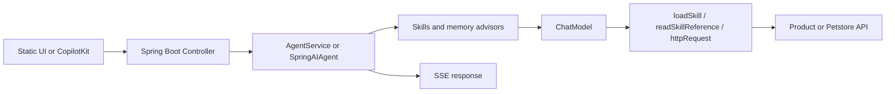

# Document Templates — spring-ai-skills-demo

These templates are starting points. Adapt them to the existing repository instead of creating redundant documents.

## README.md

```markdown
# {Project Name}

> {One-line description} | {3-5 keywords} | {Tech stack highlight}

{2-3 sentences explaining what the project demonstrates and who should use it.}

## Features

- **{Feature 1}**: {Brief explanation}
- **{Feature 2}**: {Brief explanation}
- **{Feature 3}**: {Brief explanation}

## Quick Start

### Prerequisites

- JDK 17+
- Maven 3.8+
- {External provider/database prerequisite, if required}

### Configuration

```bash
cp .env.example .env
# edit .env; do not commit it
set -a && source .env && set +a
```

### Build and run

```bash
mvn -DskipTests clean package
mvn spring-boot:run -DskipTests
```

## URLs

| Feature | URL |
|---|---|
| Static UI | http://localhost:8080/ |
| Swagger UI | http://localhost:8080/swagger-ui.html |
| OpenAPI JSON | http://localhost:8080/v3/api-docs |
| Next.js frontend | http://localhost:4000 |

## Documentation

| Document | Description |
|---|---|
| [AGENTS.md](AGENTS.md) | Current-state agent navigation |
| [CLAUDE.md](CLAUDE.md) | Compatibility redirect |
| [docs/](docs/) | Stable guides and investigations |
| [TEST_REPORT.md](TEST_REPORT.md) | Verified test report |
| [frontend/README.md](frontend/README.md) | Frontend guide |
```

## AGENTS.md

```markdown
# {Project Name} — Agent Navigation

## Project Overview

- Type: Spring Boot + Spring AI application
- Runtime surfaces: REST, SSE, AG-UI, static UI, Next.js/CopilotKit
- Status: active demo/development

## Documentation Index

- [README.md](README.md) — human landing page
- [AGENTS.md](AGENTS.md) — current-state agent guide
- [docs/](docs/) — stable guides and drafts
- [TEST_REPORT.md](TEST_REPORT.md) — test report
- [frontend/README.md](frontend/README.md) — frontend guide

## Quick Commands

```text
build:    mvn -DskipTests clean package
test:     mvn test
frontend: cd frontend && npm run dev
verify:   git diff --check
```

## Module Overview

| Module | Path | Responsibility |
|---|---|---|
| Agent | `src/main/java/com/example/demo/agent/` | Skills, tools, advisor |
| Service | `src/main/java/com/example/demo/service/` | Chat, multimodal, memory |
| API | `src/main/java/com/example/demo/controller/` | REST/SSE endpoints |
| Runtime Skills | `src/main/resources/skills/` | LLM-facing API instructions |
| Agent Skills | `.agents/skills/` | Portable agent workflows |

## Constraints

- Do not confuse runtime Skills with agent Skills.
- Before changing an endpoint, inspect Controller, Skill/API index, prompts, frontend schema, and tests.
- Do not treat `docs/drafts/` as current truth without checking the source.
- Keep `CLAUDE.md` as a redirect to this file.
```

## Architecture Guide

```markdown
# Architecture

> **Purpose**: Explain which components are affected by a change.
> **最后核对**: YYYY-MM-DD

## System Context

Describe the user interfaces, Spring Boot API, LLM providers, databases, vector store,
vision/transcription providers, and AG-UI/CopilotKit boundary.

## Module Structure

| Area | Path | Responsibility |
|---|---|---|
| Agent | `src/main/java/com/example/demo/agent/` | Progressive disclosure and tool definitions |
| Services | `src/main/java/com/example/demo/service/` | Agent orchestration and domain services |
| Controllers | `src/main/java/com/example/demo/controller/` | HTTP and SSE boundaries |
| Runtime Skills | `src/main/resources/skills/` | API instructions consumed by the model |
| Frontend | `frontend/` | CopilotKit UI, BFF, and browser tools |

## Request Flow



## Key Decisions

| Decision | Choice | Reason |
|---|---|---|
| Skill loading | Level 1/2/3 progressive disclosure | Avoid injecting all API instructions |
| AG-UI HTTP calls | Browser-side `httpRequest` | Browser owns user token and confirmation |
| Chat memory | JDBC window plus vector memory | Short-term and semantic context |
| Runtime API source | Controllers + runtime Skill files | Keep model instructions aligned with implementation |
```

## Development Guide

```markdown
# Development

> **Purpose**: Build, run, test, and diagnose the project locally.

## Prerequisites

- JDK 17+ for Maven compilation
- Maven 3.8+
- Node.js/npm for `frontend/`
- Provider credentials and PostgreSQL when using those paths

## Backend

```bash
cp .env.example .env
set -a && source .env && set +a
mvn -DskipTests clean package
mvn spring-boot:run -DskipTests
```

## Profiles

Explain the current `application.yml` active profile and how to select a non-PostgreSQL
profile for local H2/SimpleVectorStore testing.

## Frontend

```bash
cd frontend
npm ci
npm run dev
```

The current development port is 4000. Document `JAVA_BACKEND_URL` and
`NEXT_PUBLIC_JAVA_BACKEND_URL` separately.

## Verification

```bash
git diff --check
mvn -DskipTests clean package
```

List external prerequisites for Maven tests and each relevant E2E script.
```

## Configuration Reference

```markdown
# Configuration

> **Purpose**: Explain configuration keys without exposing secrets.

## LLM Provider

| Key | Purpose | Example |
|---|---|---|
| `LLM_PROVIDER` | Select `openai`, `anthropic`, or `minimax` | `openai` |
| `OPENAI_BASE_URL` | OpenAI-compatible endpoint | `https://api.openai.com` |
| `OPENAI_MODEL` | Chat model name | `gpt-4o` |

## Optional Providers

Document vision, transcription, SiliconFlow embedding, and PostgreSQL settings from
`.env.example` and `application*.yml`.

## Safety

- Never commit `.env` or credentials.
- State whether a default is actually active or only available through a profile.
- Note URL path conventions such as embedding base URLs when they affect correctness.
```

## REST API Guide

```markdown
# REST API

> **Purpose**: Describe endpoints that are not sufficiently covered by Swagger or runtime Skills.

## Base URL

`http://localhost:8080`

## Authentication

This demo uses a Base64-encoded demo token. It is not production JWT authentication.
Explain login, `Authorization: Bearer ...`, public endpoints, and protected endpoints.

## Endpoint

### `GET /api/example`

Description.

#### Request

```bash
curl -s http://localhost:8080/api/example
```

#### Response

```json
{}
```

#### Errors

Only document verified status codes and failure shapes.

## SSE

Document `Content-Type: text/event-stream`, event boundaries, `[DONE]`, and any
project-specific `type` fields when applicable.
```

## Troubleshooting Guide

```markdown
# Troubleshooting

> **Purpose**: Diagnose failures by symptom.

## Application does not start

### Symptoms

...

### Diagnosis

```bash
java -version
mvn -version
git status --short
```

### Solution

...

## LLM or tool call fails

Check provider configuration, Skill path, tool schema, API index, and relevant logs.

## PostgreSQL/vector store fails

Check active profile, JDBC URL, credentials, pgvector extension, and embedding
configuration.

## Streaming or AG-UI fails

Check backend port 8080, frontend port 4000, BFF URL variables, SSE buffering,
authentication propagation, and timeout configuration.
```

## Draft Document

```markdown
# {主题}

> **状态**: 规划中 / 调查中 / 已实施 / 已废弃
> **目的**: 说明这份文档支持的决策或工作。
> **最后核对**: YYYY-MM-DD

## 背景

## 当前事实

## 方案或调查步骤

## 验证结果

## 决策与后续工作

## 相关文件
```

## Documentation Plan

```markdown
# 文档体系建设计划

> **目的**: Track a multi-document documentation initiative.
> **最后核对**: YYYY-MM-DD

## Priorities

| Priority | Document | Source of truth | Status | Validation |
|---|---|---|---|---|
| P0 | `AGENTS.md` | Current source/config | pending | link and fact audit |
| P1 | `docs/ARCHITECTURE.md` | Java/TS architecture | pending | source review |
| P2 | `docs/troubleshooting.md` | logs and verified fixes | pending | reproduce issue |

## Dependencies

Describe which documents must be updated together.

## Notes

Record stale docs, external prerequisites, and decisions not to create redundant files.
```

## Archive Index

```markdown
# 归档文档

> 历史文档，仅供参考，不再维护。

| 日期 | 文件 | 说明 |
|---|---|---|
| YYYY-MM-DD | [YYYY-MM-DD_topic.md](YYYY-MM-DD_topic.md) | Why it was archived |
```
